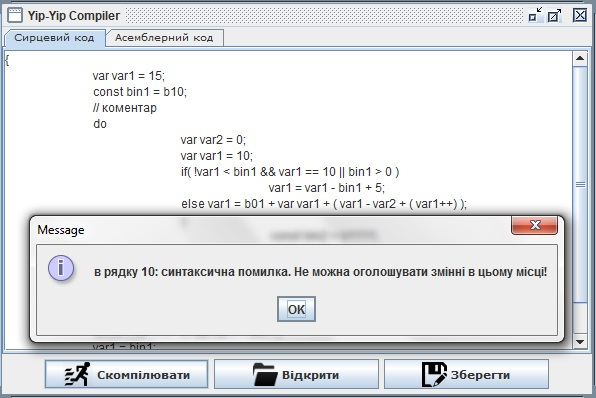

Yip-Yip Compiler
=====================================
            
Даний компілятор здійснює трансляцію в мову асемблера. Трансцяція здійснюється з мови, що описується наступними правилами продукції (записано в форматі EBNF згідно стандарту BSI):       
`Program = Block ;`     
`Block = ‘{’, Stmts, ‘}’ ;`     
`Decls = [ Decls, Decl ] ;`     
`Decl = ( ‘var’ | ‘const’ ), Id, ‘=’, Num, ‘;’ ;`     
`Stmts = [ Stmts, Stmt ] ;`     
`Stmt =  RightConstr | IfConstr | DoWhileConstr | WhileConstr | Block | Decls ;`     
`RightConstr = Id, ‘=’, ArithmeticExpr, ‘;’ ;`     
`IfConstr = ‘if’, ‘(’, LogicExpr, ‘)’, Stmt, [ ‘else’, Stmt ] ;`     
`DoWhileConstr = ‘do’, Stmt, ‘while’, ‘(’, LogicExpr, ‘)’, ‘;’ ;`     
`WhileConstr = ‘while’, ‘(’, LogicExpr, ‘)’, Stmt ;`     
`ArithmeticExpr = ArithmeticExpr, ( ‘+’ | ‘-’ ), ArithmeticTerm | ArithmeticTerm ;`     
`ArithmeticTerm = Operand | ‘(’, ArithmeticExpr, ‘)’ | Id, ‘++’;`     
`LogicExpr = LogicExpr, ‘&&’ , Or | Or ;`     
`Or = Or, ‘||’ , [‘!’], CompareExpr | [‘!’], CompareExpr ;`     
`CompareExpr = Operand, ( ‘>’ | ‘<’ | ‘==’ ), Operand ; `     
`Operand = Id | Num ;`     
`Id = Letter, { Letter }, { Digit } ;`     
`Num = Digit, { Digit } | ‘b’, ( ‘0’ | ‘1’ ), { ( ‘0’ | ‘1’ ) } ;`     
`Letter = ‘A’ | ‘B’ |... | ‘Z’ | ‘a’ | ‘b’ | ... | ‘z’ ;`     
`Digit = ‘0’ | ‘1’ | ‘2’ | ‘3’ | ‘4’ | ‘5’ | ‘6’ | ‘7’ | ‘8’ | ‘`9’;     

Дана граматика відповідає наступним вимогам:     
– типи даних: змінні розміром 1 байт, двійкові константи ;     
– арифметичні операції: додавання(+), віднімання(–) , інкремент(++);     
– операції порівняння: більше (>), менше (<), рівне (==);     
– логічні операції: І (&&), АБО (||), НЕ (!);     
– оператор присвоєння (=);     
– символи групування арифметичних операцій “(” , “)”;     
– складений оператор  – { // тіло };     
– умовний оператор  – if(умова) вираз [ else вираз ];     
– оператор циклу з постумовою  – do вираз while(умова);     
– рядкові коментарі типу  //текст_коментаря;    
    
*Лексичний аналізатор* складається із класу Lexer і декількох допоміжних класів. Клас Lexer виконує сканування чергового символа з вхідного потоку із передуванням на 1 символ та повертає токен для сканованої лексеми.    
*Синтаксичний аналіз* відбувається за алгоритмом предиктивного аналізу (простий вид аналізу методом рекурсивного спуску, при якому символ, що сканується, однозначно визначає потік керування в тілі процедури для кожного нетермінала; послідовність викликів процедур при обробці вхідного рядка неявно визначає дерево розбору і при необхідності може використовуватися для його явної побудови). Аналізатор намагається побудувати дерево розбору, керуючись правилами граматики вхідної мови, у випадку неможливості побудови такого дерева видається повідомлення про синтаксичну помилку.    
Аналізатор перевіряє чи змінна була оголошена і ініціалізована перш, ніж використовуватись. Також відбувається перевірка на спробу змінити значення константи.   
Програма представляється в *формі асемблерного коду*, переведення виконується разом із синтаксичним аналізом, після перевірки правильності лексеми, вона переводиться в асемблер.          
У якості *таблиці символів* використовується клас HashMap із колекції Java.   
*Більш детальний опис дивіться в **[пояснювальній записці](./info.doc)**.*    
**Тестова програма для перевірки роботи компілятора знаходиться в файлі [test.txt](./test.txt).**      

#### [Версія з графічним інтерфейсом](./IDE_Version/) використовує Swing.

#### Запуск [консольної версії](./Console_Version/):
Запускати через командний рядок:
YYCC.exe назва_вхідного_файлу [назва_вихідного_файлу]

---вирази в [] є необов'язковими

Можна також запускати подвійним кліком, в такому випадку з'явиться вікно вводу шляху до вхідного файлу, вихідний файл буде збережено з такою самою назвою, але з розширенням *.ASM

P.S. Рекомендовано мати Notepade++, встановленим на ПК, тому що програма після збереження результату в файл намагається його відкрити за допомогою Notepade++.

#### Література:
А. Ахо, М. Лам, Р. Сеті, Дж. Ульман - "Компілятори: принципи, технології й інструментарій" ([Книга дракона](./Dragons_Book.zip)).